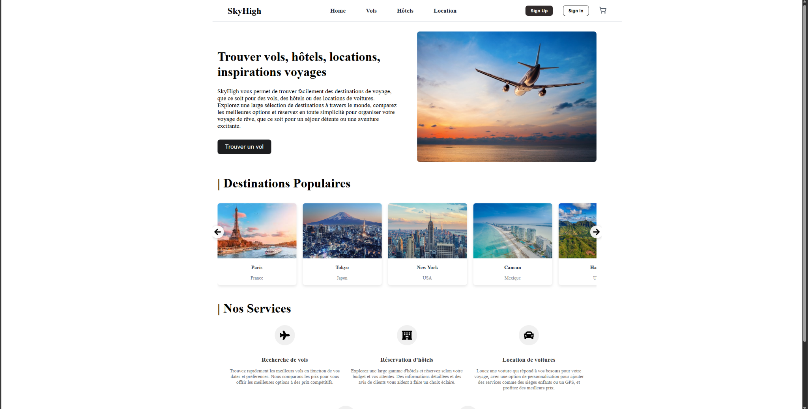
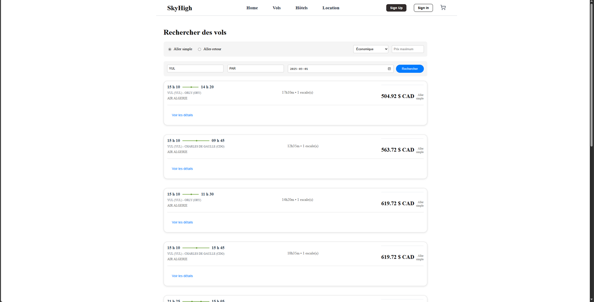
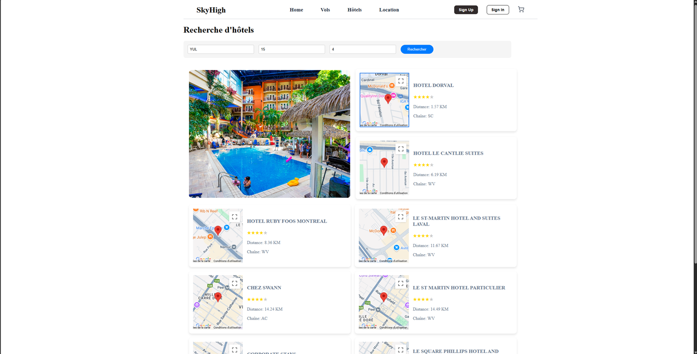
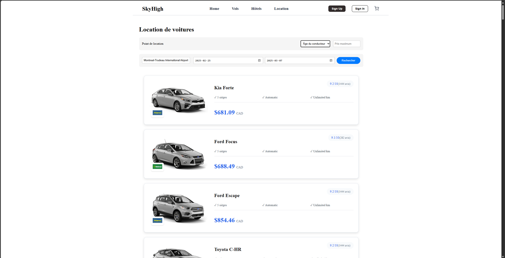
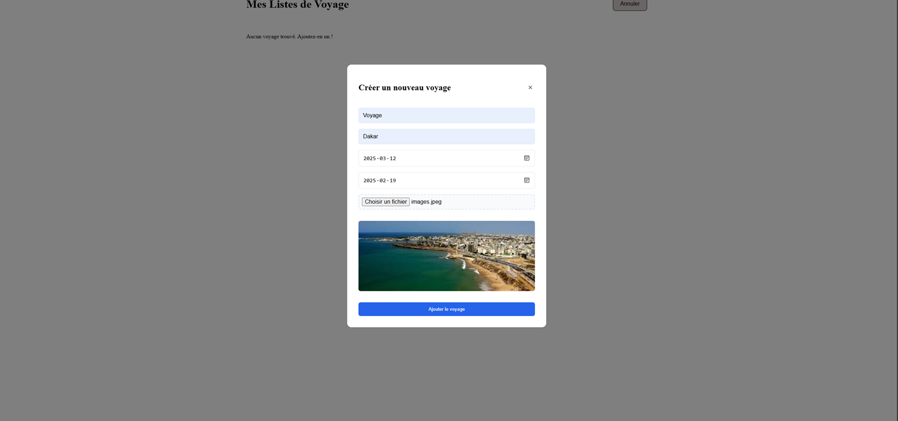
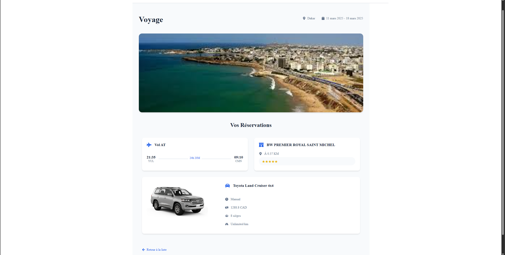

# 🌍 Travel Booking App

🧳 Application de réservation de voyages développée dans le cadre d’un projet scolaire en mai 2025.

## 🛠 Technologies utilisées
- **React** (Vite)
- **Firebase** (authentification, base de données, hébergement)
- **JavaScript / JSX**
- **CSS**

## ✈️ Fonctionnalités principales
- Réservation d'hôtels, de vols et de voitures
- Authentification par courriel (Firebase Auth)
- Interface responsive (mobile & desktop)
- Sauvegarde des données utilisateur
- Intégration d’une carte (Google Maps API ou Leaflet)

## 📅 Détails
- 📆 **Projet complété** : mai 2025  
- 🚀 **Déployé sur GitHub** : juillet 2025 (pour portfolio)
- 👨‍💻 **Réalisé par** : Sofiane Ferhaoui

## 📸 Aperçu

### Page d’accueil

### Recherche de vols

### Recherche d’hôtels

### Location de voitures

### Ajout à une liste

### Résumé du voyage

